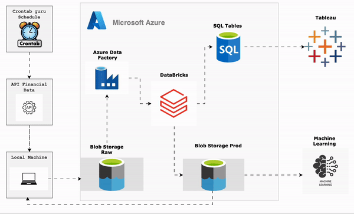

```{r setup, include=FALSE}
knitr::opts_chunk$set(echo = TRUE)
```




## Welcome

In the dynamic landscape of financial markets, where real-time data and informed decision-making are crucial, the integration of advanced technologies has become imperative. Recognizing the significance of this, I have embarked on a comprehensive project aimed at creating an end-to-end automated **pipeline** for the collection, processing, and analysis of daily stock data. This project is tailored to cater to the financial performance of key market players, including **AAPL**, **MSFT**, **GOOGL**, and **AMZN**. The overarching goal is to provide stakeholders with a robust, systematic, and scalable solution that empowers them in making data-driven investment decisions.


## Data collection

I used a [**Python**](https://github.com/mus514/ML_Pipeline_Hub/blob/main/azure_api_daily_load.py) script to gather information about stocks. This script talks to financial websites using an **API**, which is like a special connection. The **API** assists it in fetching daily data for particular companies. I made sure the script can handle errors to keep the data reliable. Each timethe script is run, it creates a log with details like how much data it got, the date, and the stock name, and saves it in a text file named **output.txt**.

{width="400" height="180"}


## Scheduled Execution via Crontab


The [**crontab**](https://crontab.guru) scheduler is a tool used in MacOS to schedule the execution of commands or scripts at specific times. It uses a syntax to define the schedule, allowing users to automate tasks.It plays a pivotal role in automating the execution of the **Python** script. The Python script is scheduled to run at **9 pm**. This timing ensures that the stock data is consistently updated, providing users with the latest market information at the specified time each day.

Upon successful execution of the script, another scheduled task is triggered to verify if all stock are loaded and then transfer the data files from the local machine to the designated **raw** folder in **Azure Blob Storage** using **AZCOPY**. Raw data often refers to unprocessed or minimally processed data that is directly collected from sources. In this context, the **raw** folder acts as the starting point for storing stock data before any further processing or analysis.

{width="700" height="200"}


## Azure Data Factory Orchestration

After the successful transfer of data files to the designated "raw" folder in **Azure Blob Storage**, this folder now contains the raw, unprocessed stock data. An event trigger is configured within **Azure Data Factory**, a cloud-based data integration service by Microsoft. This event trigger is set to automatically activate when new files are detected or added to the **raw** folder in **Azure Blob Storage**.

Upon the activation of the event trigger, a workflow is initiated to integrate with **Databricks**, a big data analytics platform. This integration involves the execution of a series of **6 notebooks** within the **Databricks** environment. The 6 notebooks contain specific code and tasks related to the processing, transformation, and analysis of the raw stock data.

The diagram depicts both the pipeline structure and the interdependencies among the scripts within the notebooks.

{width="700" height="250"}


## [Databricks Notebooks for Data Processing and Analysis](https://github.com/mus514/ML_Pipeline_Hub/tree/main/Daily-process_Notebooks)

### 5-1 Daily Data Processing ("daily_process_stocks"):

The first notebook, **daily_process_stocks**,  leverages **PySpark** to clean and transform raw data. Processed data is stored in the **clean** folder within **Azure Blob Storage** in **.csv** format, ready for further analysis.

The notebook initiates a process of refining column names within the raw data. This involves addressing potential inconsistencies, such as *whitespace*, *special characters*, or any *irregularities* that may hinder downstream analysis.

To enhance clarity and ease of reference, the notebook standardizes column names, ensuring a **uniform naming** convention across all datasets. This not only improves data consistency but also streamlines subsequent operations, making the data more accessible to automated processes.

A critical aspect of data integrity lies in ensuring that each column's data type corresponds accurately to its content. The notebook incorporates robust **schema** validation procedures to confirm that each column contains the expected data type.


While **PySpark** is a powerful tool for data processing, it lacks flexibility when it comes to naming saved data files. To tackle this limitation, there is a need to traverse through files in different folders. Unfortunately, the required functionality is not present in **db.utilities**. As a solution, I created a **recursive function** [**(get_files_paths_from_folders)**](https://github.com/mus514/ML_Pipeline_Hub/blob/main/library/daily_utilities.ipynb) designed to systematically retrieve the paths of all files within the specified folder and its subfolders. The purpose of this function is to retrieve all file names from a temporary folder. Subsequently, these files can be saved to the desired folder with specific names as needed.


### 5-2 Stocks information and prices ("daily_stocks-prices_sql_tables"):

Another notebook is specifically dedicated to creating individual SQL tables for each stock, and another one is dedicated to a table for storing prices. The individual SQL tables for each stock facilitate easy joining of tables, enabling seamless data visualization in **Tableau** or **Power BI**. The second table is used to calculate stock returns from the prices, consolidating this information for each stock into a single table.

### 5-3 Log Returns Calculation:
In a subsequent notebook, **log returns** are calculated using Spark, offering a crucial metric for comprehending stock performance.

The log return is employed for **stationarity**, addressing the time dependence inherent in stocks. Utilizing log returns helps mitigate this temporal dependence.

The **log return** is given by: 

$$
r_t = log(\frac{P_t}{P_{t-1}})
$$

where $P_t$ is the stock price at time t

```{r echo=FALSE, message=FALSE}
prices <- read.csv("data/prod/stocks_prices.csv")
returns <- read.csv("data/prod/returns.csv")
plot(prices$aapl, type="l", ylab="Price in $", main = "AAPL Price", col="gray")
plot(returns$aapl*100, type="l", ylab="Return in %", main = "AAPL Return", col="gray")
```

In a plot of stock prices, you see more pronounced fluctuations, especially if the stock has experienced significant price changes. Log returns, on the other hand, can exhibit a more consistent spread of values, making it easier to identify patterns or trends.
 
### 5-4 GARCH(1,1) Volatility (daily_volatility_sql_tables):

This notebook is dedicated to the computation of daily volatility using the GARCH model and the subsequent creation of a table containing all the computed values. 

The **GARCH** model is motivated by the need to better capture the characteristics of financial time series data, especially the time-varying and autocorrelated nature of volatility. Its application has proven valuable in various financial domains, including risk management, option pricing, and forecasting, making it a widely used tool in quantitative finance.

The **GARCH** model comprises several parameters that need to be estimated from observed data. The Maximum Likelihood Estimation **(MLE)** method is the most commonly used estimation method. The **GARCH** model with a normal distribution, also known as **GARCH(1,1)**, is a specific variant of the GARCH model in which the errors $\epsilon_t$ follow a normal distribution.

$$
r_t = \sigma_t \times \epsilon_t, \ \ \ \epsilon_t \sim iid \ N(0,1)
$$


$$
\sigma_t^2 = \omega + \alpha r_{t-1}^2 + \beta \sigma_{t-1}^2
$$

where $\omega \ge 0$, $\alpha,\beta > 0$ et $\alpha+\beta < 1$

$\sigma_t^2$ represents the conditional volatility at time t.

$r_{t-1}^2$ is the squared return at time t-1.

$\omega$ is the constant term.

$\alpha$ is the coefficient measuring the impact of the previous return on conditional volatility.

$\beta$ is the coefficient measuring the impact of the previous volatility on conditional volatility.

The minimized likelihood function is expressed as:

$$
L(r|\theta) = f(r_1, ..., r_n|\theta) = f(r_1) \times f(r_2|r_1) \times \dots \times f(r_n|r_{n-1}...r_1)
$$

$$
l(r|\theta) = log(L(r|\theta)) = log(f(r_1, ..., r_n|\theta) = f(r_1) \times f(r_2|r_1) \times \dots \times f(r_n|r_{n-1}...r_1))
$$

$$
l(r|\theta) = \sum_{i=1}^n log(f(r_i|\sigma_i^2)) = \sum_{i=1}^nlog(\frac{1}{\sqrt(2\pi\sigma_i^2)} e^{-\frac{1}{2}(\frac{r_i}{\sigma_i})^2})
$$

In the context of optimization, maximizing $L(r|\theta)$ is equivalent to minimizing $-l(r|\theta)$.

After estimating the parameters, the volatility is given by :

$$
 \hat{\sigma}_{t}^2 = \hat{\omega} + \hat{\alpha} r_{t-1}^2 + \hat{\beta} \hat{\sigma}_{t-1}^2
$$

For a detailed examination of the function I employed to determine the optimal parameters, please refer to this [code](https://github.com/mus514/ML_Pipeline_Hub/blob/main/library/garch_model.ipynb).


```{r echo=FALSE, message=FALSE}
vol <- read.csv("data/prod/volatilities.csv")
plot(vol$aapl*100, type="l", ylab="Volatility in %", main = "AAPL Garch volatility", col="gray")
```

### 5-5 Monte-Carlo simulation (daily_monte-carlo_simulation_sql_tables)

This notebook is dedicated to conducting `n` simulations for the future `m` days for each stock price. In this instance, I have opted for `1000` simulations over the next `250` days. 

The simulation is carried out in several steps: 

  * The initial step involves fitting the GARCH model to determine the optimal parameters. $\omega, \alpha, \beta$
  * Generate **250** simulations from a Normal distribution $\epsilon_t \sim N(0,1)$.
  * The return of at time `t` is given by : $r_t=\epsilon_t\sigma_t$
  * From $r_t$ and $\sigma_t$ we can calculate $\sigma_{t+1}$
  * Each simulated value will contribute to calculating both the volatility and the return for the subsequent day.


After getting the simulated returns, we can calculate the stock price for the next `250` days starting from the last observed price, denoted as $S_0$.

The price at time `t` is given by :

$$
S_t = S_0e^{\sum_{i=1}^tr_i}
$$
Lastly, repeat this process 1000 times.

After simulation we got this result

```{r echo=FALSE, message=FALSE, warning=FALSE}
sim <- read.csv("data/prod/aapl_simulation.csv")
matplot(sim, type = "l", ylab = "Price", main="AAPL simulation")
```

By analyzing the simulation, we can examine the price distribution for each, enabling the calculation of various risk measures such as **VaR** and **CVaR**. Both **VaR** and **CVaR** are essential tools for quantifying and measuring the potential downside risk of a portfolio or investment.

VaR and CVaR are given by :

$$
VaR_{5\%} = F^{-1}_X(0.05)
\\
CVaR_{5\%} = \mathbb{E}[X|X\leq VaR_{5\%}]
$$


For example lets analyse the in `250` days

```{r echo=FALSE, message=FALSE, warning=FALSE}
x <- as.numeric(sim[252,1:1000])
hist(x, breaks = 100, main = "Distribution of the last prices of AAPL", xlab = "price")
VaR <- quantile(x, 0.05)
CVaR <- mean(x[x <= VaR])

abline(v = VaR, col = "red", lty = 2)
abline(v = CVaR, col = "blue", lty = 2)
legend("topright", legend = c(paste0("VaR=", round(VaR, 2)), paste0("CVaR=", round(CVaR, 2))), col = c("red", "blue"), lty = 2)

```


## Data Visualization and Utilization in Tableau:

This notebook focuses on joining various tables to create a cohesive dataset for visualization purposes, combining stock information, prices, returns, volatility, and simulated prices.


A scheduled task facilitates the loading of the processed data onto the local machine, making it accessible for visualization in Tableau Public. Tableau becomes the central platform for stakeholders to explore, analyze, and derive insights from the integrated financial data.


